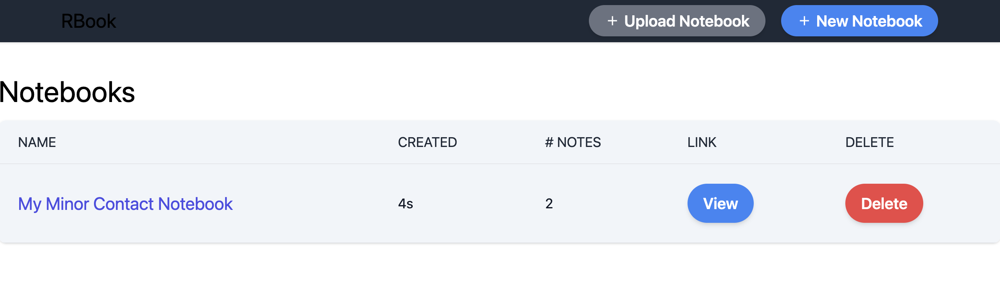
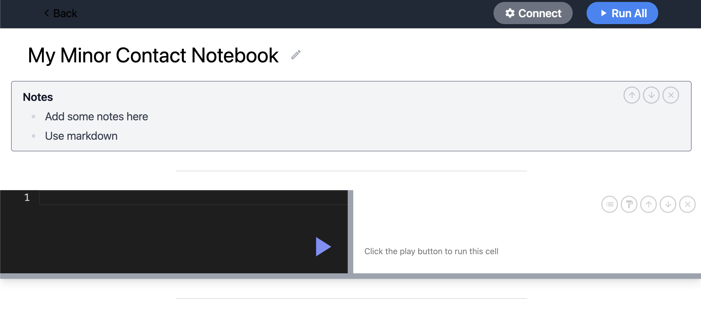
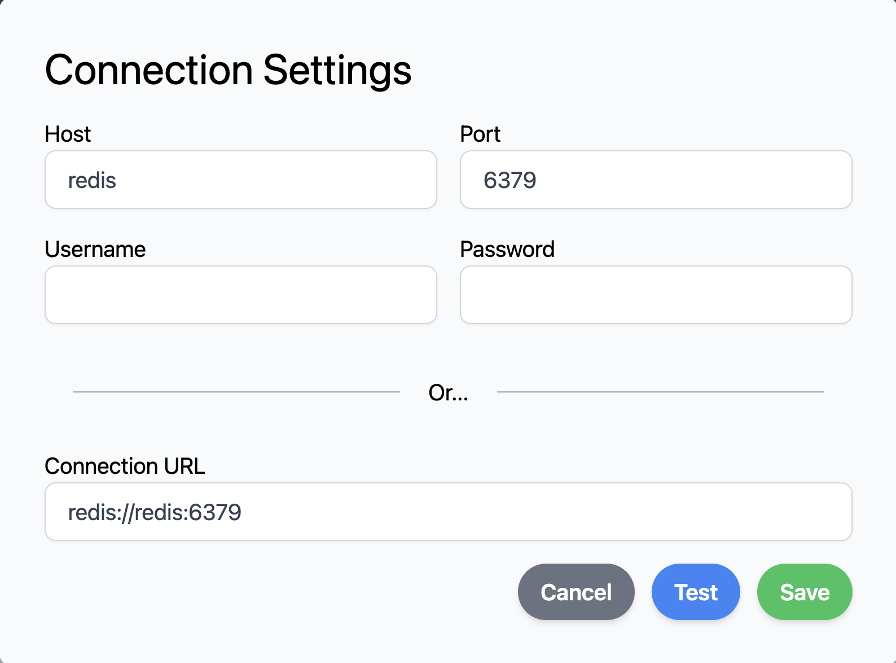
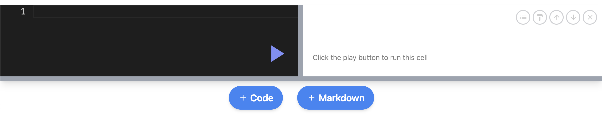

# Redis with RBook

## RBook

This is an UI package for Redis Client-Side execution. You can run redis commands in the browser without install any redis client package.

## Environment

- Port outside container / inside container local
  - 3050 / 3050
  - 6379 / 6379
- Version
  - node: 20
  - redis: 7.2

## Build

```bash
$ docker-compose up -d
```

## How To Use

- Go To [Dashboard](http://localhost:3050).
- Click button "New Notebook" at upper right corner. This action will create a sheet. Refresh current page if not auto redirect to sheet page.
- Click button "Connect" at the banner to set your "Connection Settings" of RBook to Redis.
- There are 2 kinds of field type, "Code" and "Markdown", you can use in the sheet page.

| *Dashboard* |
|:--:|
||

| *Sheet* |
|:--:|
||

| *Connect* |
|:--:|
||

| *Fields* |
|:--:|
||
