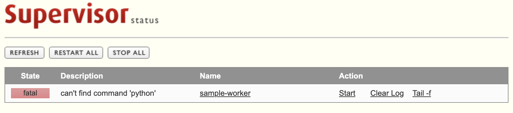

# Supervisor

## Environment

- Port outside container / inside container local
  - 9001 / 9001
- Version
  - ubuntu: 20.04

## Build

```bash
$ docker-compose up -d
```

## How To Use Supervisor Status

- Go to [UI](http://localhost:9001).

| *Supervisor Status* |
|:--:|
||
